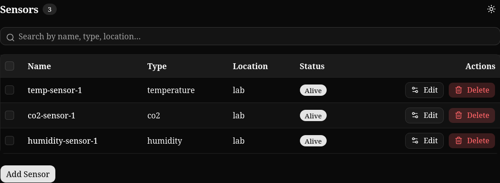
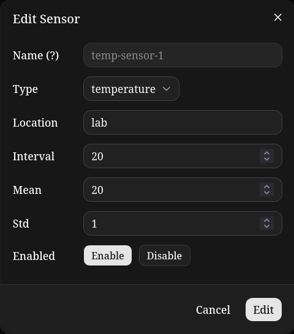
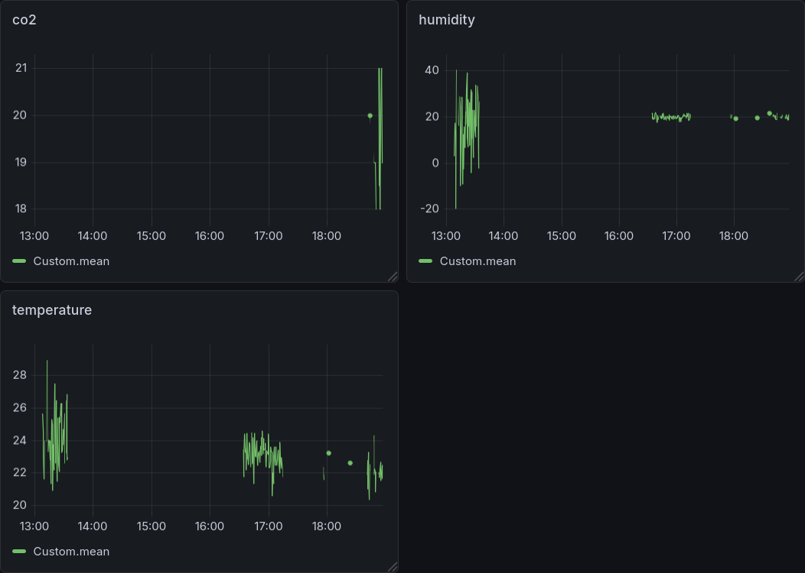
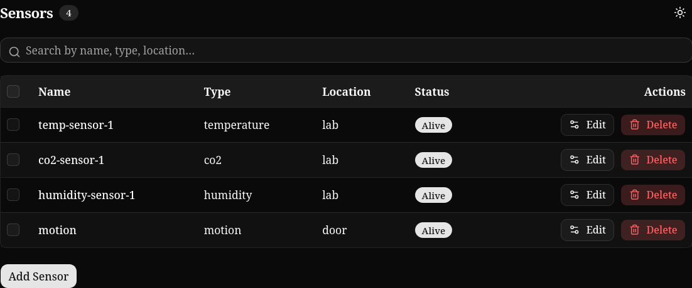
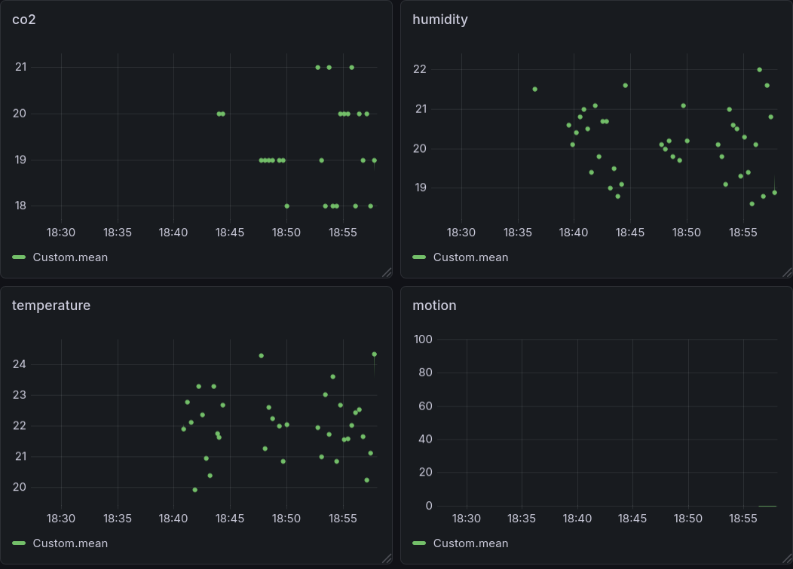

# TIGMA (Telegraf, InfluxDB, Grafana, Mosquitto, API)

## Overview

A containerized IoT monitoring platform built on the **TIG stack** (Telegraf, InfluxDB, Grafana), extended with an MQTT broker, a control/registry API, a Telegram alert bot, and Chronograf for database inspection.

Sensors are fully simulated in Docker, with support for real LoRaWAN devices via The Things Network (TTN).

Simply run
```sh
docker compose up
```
to get everything up and running


<details>
<summary><strong>Architecture</strong></summary>

## Architecture

```
[Sensors] ──publish──► [MQTT Broker] ◄──subscribe── [Telegraf] ──write──► [InfluxDB]
                            ▲                                                    │
                            │                                               [Grafana]
                    [Control API] ──publish──► control/sensors/{id}              │
                            │                                              [Chronograf]
                    [Device Registry]
```

---

## Services

| Service       | Image             | Role                                            |
| ------------- | ----------------- | ----------------------------------------------- |
| `sensor-*`    | custom            | Simulated sensors, one container per sensor     |
| `mosquitto`   | eclipse-mosquitto | MQTT broker                                     |
| `telegraf`    | telegraf          | Metric ingestion pipeline                       |
| `influxdb`    | influxdb          | Time-series database                            |
| `grafana`     | grafana           | Dashboards and alerting                         |
| `chronograf`  | chronograf        | InfluxDB web UI                                 |
| `control-api` | custom            | REST API for sensor control and device registry |

---

## Design Choices

### One Container per Sensor

Each sensor runs in its own container. This allows heterogeneous sensors with different runtimes, languages,
and dependencies to coexist without conflict, making it trivial to simulate a fleet of sensors on a single machine.

### MQTT as the Transport Layer

Sensors publish to a central Mosquitto broker. Telegraf subscribes via the `mqtt_consumer` input plugin,
which maintains a persistent connection.

### Network Isolation per Location

Each physical location (e.g. house A, house B) is assigned a separate Docker bridge network, simulating real network separation.
All sensors on a bridge publish to the shared MQTT broker, which sits on a network accessible to Telegraf.

### Control via Reverse MQTT Channel

Rather than exposing a REST endpoint on every sensor container (which would require managing many ports), sensors subscribe to a `control/sensors/{id}` MQTT topic.
The control API publishes commands to this topic.
This scales to any number of sensors with no infrastructure changes.

### Device Registry

Sensor metadata (location, type, owner) is stored in the control API's database (SQLite).
Sensors are identified by ID; metadata is decoupled from the sensor process itself.

### Alerting

Grafana's built-in alerting evaluates rules against InfluxDB queries and dispatches notifications to a Telegram bot via webhook.
For simple use cases, Grafana's native Telegram integration is sufficient without a custom bot service.

### Persistence

InfluxDB data is mounted on a Docker named volume to survive container restarts.

### Chronograf

Chronograf provides a web UI for exploring InfluxDB directly, useful for debugging ingestion and writing ad-hoc queries.

---

## Ports

| Service     | Port |
| ----------- | ---- |
| Grafana     | 3000 |
| Chronograf  | 8888 |
| InfluxDB    | 8086 |
| Control API | 8080 |
| Mosquitto   | 1883 |

---

## Security Notes

* MQTT broker uses username/password authentication via Mosquitto password file.
* Credentials are passed via environment variables and Docker secrets, never hardcoded.

</details>

<details>
<summary><strong>Dashboard Demo</strong></summary>

# Tigma Dashboard Demo

## Startup

After starting the stack, open:

* Control UI: `http://localhost:3000`
* Grafana: `http://localhost:3001`

On startup, three sensors are available by default.



Each sensor can be edited from the Control UI.



---

## Grafana Configuration

Login to Grafana using the provided credentials.

### InfluxDB Data Source

Configure a new InfluxDB data source with:

| Setting     | Value                  |
| ----------- | ---------------------- |
| URL         | `http://influxdb:8086` |
| Database    | `sensorsdata`          |
| Measurement | `Custom`               |
| Password    | `uforobot`             |
| HTTP Method | `GET`                  |

After configuring the data source, create a dashboard similar to:



---

## Adding New Sensors

Additional sensors can be started dynamically using Docker:

```bash
docker run --rm \
  --network tigma_app-net \
  -e SENSOR_NAME=motion \
  -e CONTROL_API_URL=http://api:8000 \
  -e MQTT_DATA_HOST=mqtt \
  vuzz/tigma-sensor
```

The new sensor will automatically register with the platform.

Changes are reflected in the Control UI approximately every 3 minutes.



---

## Updating Grafana Dashboards

Once the new sensor begins publishing data, update the Grafana dashboard to include the additional measurements.

Example:



---

## Result

The platform supports:

* Dynamic sensor registration
* Sensor configuration through the Control UI
* Real-time data collection
* Dashboard visualization with Grafana
* Automatic discovery of newly deployed sensors

</details>
